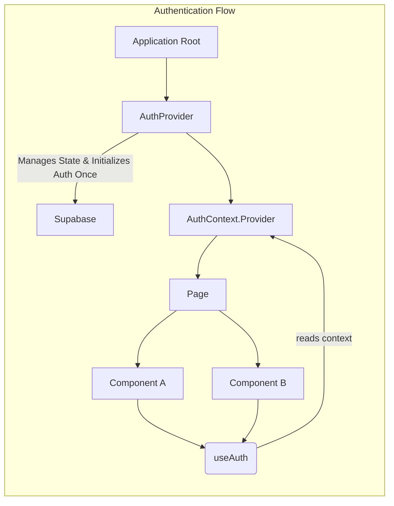

# Authentication Infrastructure

This document outlines the authentication architecture for the application. The system is designed to ensure that a user is always authenticated, starting with an anonymous session that can be optionally linked to a Google account.

## Core Principles

1.  **Always Authenticated**: The application ensures that there is always an active user session. Upon first visit, an anonymous user is created. All subsequent operations, whether by an anonymous or a logged-in user, occur within an authenticated context.
2.  **Centralized Logic**: Authentication state and logic are managed centrally, preventing redundant initializations and ensuring a single source of truth for the user's identity.
3.  **Seamless Session Transition**: When a user signs out, the system automatically initiates a new anonymous session. This maintains the "always authenticated" principle and provides a consistent user experience.

## Architecture Overview

The authentication system is built upon React Context and a provider pattern. This ensures that authentication is initialized once at the application's root and the user's status is consistently available to all components.

### Components

*   **`AuthProvider.tsx`**: This is the heart of the authentication system. It is a client-side component that:
    *   Initializes the Supabase client.
    *   On mount, checks for an existing user. If none exists, it creates an anonymous user.
    *   Manages the `user` object and an `isLoading` state. The application's UI is not rendered until the initial authentication check is complete (`isLoading` is `false`), preventing race conditions.
    *   Handles user profile creation and updates (`handleProfileSetup`).
    *   Provides authentication functions (`logInWithGoogle`, `linkWithGoogle`, `signOut`) to the rest of the application via the `AuthContext`.
    *   Wraps the entire application in `src/app/layout.tsx`.

*   **`AuthContext.tsx`**: This file defines the `AuthContext` and the shape of the data it holds (`AuthContextType`). It also exports the `useAuth` hook.

*   **`useAuth.ts`**: A simple hook that provides access to the `AuthContext`. Any component that needs to access user data or authentication functions can use this hook. It throws an error if used outside of an `AuthProvider`, ensuring proper component hierarchy.

## How It Works

1.  When the application loads, the `AuthProvider` in `layout.tsx` is mounted.
2.  The `AuthProvider`'s `useEffect` hook immediately attempts to get the current user from Supabase.
3.  If no user is found, it calls `signInAnonymously()` to create a new anonymous user.
4.  Once a user object is available (either existing or newly created), `handleProfileSetup` is called to ensure a corresponding user profile exists in the database.
5.  The `user` state is updated, and `isLoading` is set to `false`.
6.  The rest of the application, which was waiting for `isLoading` to be `false`, now renders with access to the user's context.
7.  Components like `NewspaperHeader` or `AdminGuard` call `useAuth()` to get the current user and auth functions without triggering any new authentication logic.

This architecture ensures a robust, predictable, and clean authentication flow that is central to the application's stability.